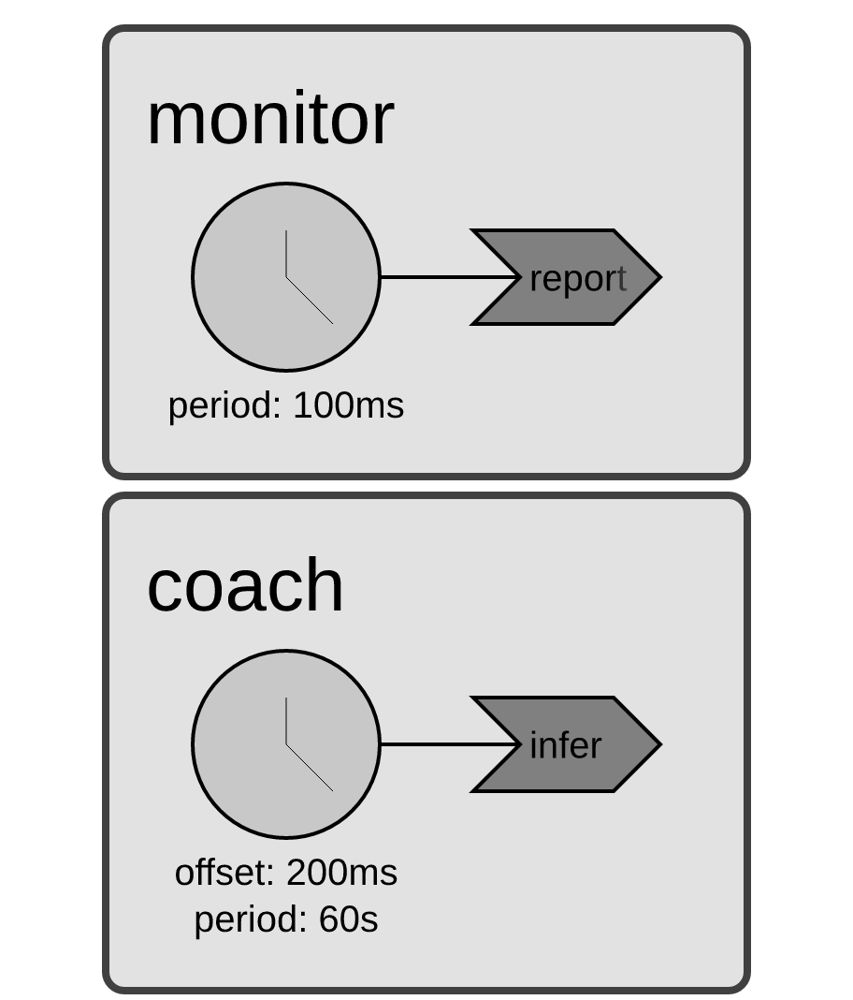
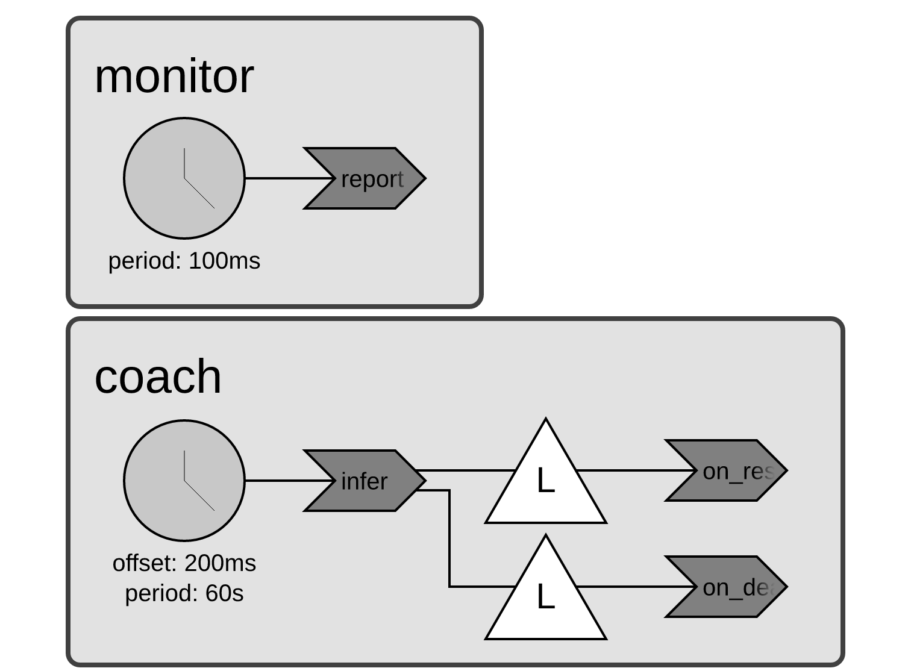
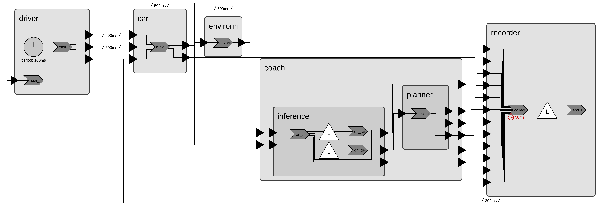

# ISCPS Project Lab: Agentic Driving Coach

CSE 494/598 · 4 points (common) + 1 point (CSE 598 extension) ·
estimated 4-6 hours after setup

Record every answer in `submission/answers.md` (copy
`submission/answers_template.md`). Keep answers short - numbers, one-liners,
and small tables beat essays.

This project examines how logical time, wall-clock inference latency, response
quality, and deterministic fallback affect a simulated car approaching a stop
sign.

For more context, please feel free to refer to the
[demo video](https://youtu.be/ucXgmFU9k_4?si=-bnngLY0c4ku8Kc_) and 
[technical paper](https://arxiv.org/pdf/2604.11705) of the agentic driving coach.

## Learning objectives

After completing the project, you should be able to:

- identify reactors, reactions, ports, timers, and logical delays in Xronos;
- distinguish logical time from wall-clock time, lag, and slack;
- run reproducible rule and replay experiments;
- measure live-model latency, deadline misses, and malformed responses; and
- connect coach behavior and fallback decisions to the physical outcome.

---

## Part 0 - Setup and environment check (ungraded)

Follow the complete Sol sequence in [README.md](README.md). ASU Sol is the
default platform, and a personal Linux machine is optional. Do not build the
image, run Python, download models, or run Ollama on a Sol login node.

```bash
coach doctor
coachpy scripts/check_environment.py
coachpy examples/01_hello_reactor.py
coachpy examples/02_timer_and_ports.py
coachpy examples/03_logical_delay.py
coachpy examples/04_deadline_lag.py
coachpy examples/05_retroactive_fallback.py    # real time, ~4 s
```

Confirm that the environment check writes `results/environment.txt` and that
all five examples terminate normally.

---

## Part 1 - Xronos timing warm-up (1 pt)

Re-run examples 02-05 (`coachpy examples/02_timer_and_ports.py`, etc.) and
answer **four short questions** (2-3 sentences each unless stated):

Use the [annotated examples guide](examples/README.md) to read each program's
topology before comparing it with the terminal output. Rounded boxes are
reactors, chevrons are reactions, clock-faced circles are periodic timers,
`L` triangles are programmable logical timers, and a slashed connection marks
a logical delay. These diagrams show declared structure; lag, slack, and the
order in which events actually execute remain observations from the output.

1. **Logical time.** In examples 02 and 03, which printed events carry
   *logical* timestamps, and how can you tell they are logical rather than
   wall-clock measurements?
2. **Logical delay - predict, then run.** In example 03, where in the *code*
   is the 500 ms delay configured, and where in the *output* is it visible?
   Then, **before rerunning anything**, write down exactly what the output
   will show if you change that delay to 300 ms (which lines change, to what
   values). Make the edit, rerun, and report your prediction, whether it
   matched, and one sentence on why every arrival lands at *exactly*
   send + delay, with no jitter. Revert the edit afterwards
   (`git checkout -- examples/03_logical_delay.py`).
3. **Lag and slack.** In example 04, what happens to `lag` (of the monitor)
   and `slack` (of the worker) when the worker's handler runs ~80 ms against
   a 50 ms deadline? One sentence on why the *next* monitor tick recovers.
4. **The retroactive fallback.** From example 05's output: report the
   monitor's peak lag in Phase A vs. Phase B, and how long after the
   deadline moment (request + 400 ms) each phase's fallback actually fired.
   Then 2-3 sentences: why is Phase A's after-the-fact check *not* deadline
   enforcement, and which two constructs implement the enforceable race in
   Phase B (the live coach swaps one of them for a `PhysicalEvent` in
   `src/agentic_driving_coach/reactors/coach.py`)?

   Compare the two structures before answering Question 4:

   | Phase A: after-the-fact check | Phase B: event race |
   |---|---|
   | [](diagrams/05a_retroactive_fallback_blocking.png) | [](diagrams/05b_retroactive_fallback_race.png) |

   Trace what triggers `infer`, what it schedules, and which reactions can run
   later. Use those visible paths to decide which structure represents a
   fallback that the runtime can schedule independently of model completion.

---

## Part 2 - Deterministic baseline (1 pt)

Run the stop-sign scenario with the deterministic rule coach and the beginner
driver, twice, plus one replay run (offline; CPU allocation is fine on Sol):

```bash
coach run --scenario stop-sign --driver beginner \
    --coach rule --fast --output results/rule-a
coach run --scenario stop-sign --driver beginner \
    --coach rule --fast --output results/rule-b
coach run --scenario stop-sign --driver beginner \
    --coach replay --trace data/replay/example_trace.jsonl --fast \
    --output results/replay
```

Report (short answers / one table):

The full-system topology below includes the Recorder and its observation taps.
Use it together with `src/agentic_driving_coach/scenario.py` and the reactor
implementations when answering the topology and delay questions. Click the
image for the full-size version.

[](diagrams/agentic_driving_coach.png)

1. **Topology.** List the five top-level reactors in the running system
   (the hierarchical Coach counts as one; name its two children too) and
   one sentence on each one's job (use the code under
   `src/agentic_driving_coach/reactors/` and
   `src/agentic_driving_coach/scenario.py`).
2. **Determinism.** Compare `results/rule-a/summary.json` and
   `results/rule-b/summary.json` (e.g.
   `diff <(jq 'del(.run_id, .xronos_lag)' ...)`, or any field-by-field check
   ignoring `run_id` and `xronos_lag`). Are all remaining fields identical?
   (`xronos_lag` aggregates a wall-clock measurement even in `--fast` mode.)
   Which columns of `run.csv` are *expected* to differ between repeats, and
   why exactly those?
3. **Stopping outcome.** From `results/rule-a/summary.json`: `stopped`,
   `velocity_at_stop_line_mps`, `stop_position_error_m`, `actuation_count`.
   Did the car stop at or before the sign?
4. **Delays.** Name the file and line(s)/keys where the 500 ms and 200 ms
   logical delays are configured (hint: one place in `configs/`, one place in
   `src/agentic_driving_coach/scenario.py`).
5. **Actuation arming.** From `results/rule-a/run.csv`, report the logical
   times of (a) the first decision with `coach_token = ACTUATE`, (b) the
   first non-empty `actuation`, and (c) the first row with
   `applied_action = EMERGENCY_BRAKING`. Explain each of the two gaps in one
   sentence (hints: the Planner *arms* on the first ACTUATE decision and
   *fires* on the next in `reactors/planner.py`; the actuation then travels
   over a delayed connection from Part 2 question 4).
6. **Hands on a reactor - predict, then run.** The Planner never tells the
   driver the coast is clear: on a NONE decision in WARNING mode it
   de-escalates silently. Edit `Planner.decide`
   (`src/agentic_driving_coach/reactors/planner.py`) so the
   WARNING -> MONITORING branch also emits an instruction - add
   `instruction_out.set("[VERBAL] NONE | Back within the safe band.")` to
   the `elif token is CoachToken.NONE ...` branch (set the port directly;
   the `speak` helper deduplicates, which an all-clear should not do).
   **Before running**, predict from your `results/rule-a/run.csv`
   `planner_mode` column how many new instruction rows this adds to the
   rule-beginner run and at which logical time(s). Then:

   ```bash
   coach run --scenario stop-sign --driver beginner \
       --coach rule --fast --output results/rule-deescalate
   ```

   Report: your diff, predicted vs. observed count and time(s) of the new
   instruction(s), and confirmation that `actuation_count` and the stopping
   outcome are unchanged - plus one sentence on *why* they must be. Then
   revert (`git checkout -- src/agentic_driving_coach/reactors/planner.py`)
   so Parts 3-4 run the reference coach.

---

## Part 3 - Small-model timing vs. quality (1 pt)

Compare `llama3.2:1b` and `llama3.2:3b` (or two course-approved models
≤ ~4B) under identical conditions: same driver (beginner), same prompt, same
deadline, temperature 0, ≥ 3 repetitions each.

### On Sol (default)

One-time Ollama setup, **inside an allocation** (each model pull is 1.3-2 GB
and takes several minutes; both models are required):

```bash
module load zstd-1.5.2-gcc-11.2.0
mkdir -p /scratch/$USER/ollama
curl -fL https://ollama.com/download/ollama-linux-amd64.tar.zst \
  -o /scratch/$USER/ollama-linux-amd64.tar.zst
zstd -dc /scratch/$USER/ollama-linux-amd64.tar.zst \
  | tar -xf - -C /scratch/$USER/ollama
export PATH=/scratch/$USER/ollama/bin:$PATH
export OLLAMA_MODELS=/scratch/$USER/ollama-models
ollama serve &                # never on a login node
ollama pull llama3.2:1b
ollama pull llama3.2:3b
```

Then run the whole benchmark as **one GPU batch job** (recommended - the
script starts the server, pre-loads both models, runs the benchmark at the
course-validated `DEADLINE_MS=1700`, and checks its own results):

```bash
sbatch slurm/run_agentic_driving_coach.sbatch          # account preset: class_cse494598fall2026
                                      # (on a different allocation, e.g. a research
                                      #  group like grp_hkim501, edit --account)
squeue -u $USER                       # results land in results/model-comparison-<jobid>/
```

Or interactively in a GPU allocation (server running as above):

```bash
coach benchmark-models \
    --models llama3.2:1b llama3.2:3b \
    --driver beginner --repetitions 3 --deadline-ms 1700 \
    --output results/model-comparison
```

**Why 1700 ms on Sol:** Ollama's per-request model handling on Sol scratch
adds about 1.1 seconds to every request, so at the 300 ms workstation default
every request misses regardless of model. 1700 ms is the required Sol value.

### On your own machine (alternative)

```bash
ollama serve &                        # if not already running
ollama pull llama3.2:1b && ollama pull llama3.2:3b
coach benchmark-models \
    --models llama3.2:1b llama3.2:3b \
    --driver beginner --repetitions 3 --deadline-ms 300 \
    --output results/model-comparison
```

### Either way

Every live run begins with an automatic model **warm-up** (`warming up
<model> ...` log line) that can take minutes on first use - it is *not*
inference latency and is never counted in your measurements; raise
`--warmup-timeout-s` if it exceeds its bound.

The benchmark writes `comparison.csv`, `comparison.json`, `comparison.png`,
and one directory per run. Fill in the Part 3 table of the answers template -
per model: **median and p95 inference latency, deadline-miss rate, malformed
count, unsafe-false-negative count, stopping outcome** (`stopped` +
`velocity_at_stop_line_mps`).

Then a 3-5 sentence conclusion that must (a) name the metric(s) behind your
claim and (b) state the latency-vs-quality tradeoff you observed. "Model X is
better" without a metric and a tradeoff earns no credit. If a model never
misses the deadline on your platform, say so and discuss what you *would*
lower `--deadline-ms` to in order to expose the tradeoff (or actually rerun
with a tighter deadline and report that). Symmetrically, if *every* request
misses, your platform's latency floor sits above the deadline: use the value
prescribed for your platform (1700 on Sol), or raise `--deadline-ms` until at
least one model mostly meets it - and report the value you used and how you
chose it.

**Seeing the tight-deadline regime on any platform.** If your platform hides
the deadline pressure entirely (Sol at 1700 ms typically shows 0% misses),
replay the two shipped workstation traces:
`data/replay/live_llama3.2-1b_300ms.jsonl` and
`data/replay/live_llama3.2-3b_300ms.jsonl` (beginner driver, 300 ms deadline,
RTX 3060 workstation; provenance is recorded in each trace header):

```bash
coach run --scenario stop-sign --driver beginner \
    --coach replay --trace data/replay/live_llama3.2-1b_300ms.jsonl \
    --fast --output results/replay-1b-300        # and likewise for ...-3b...
```

Add the two replay rows to your Part 3 table and mark them as replays. They
are deterministic, so one run each suffices, and reproduce the recorded
misses, fallbacks, and late discards exactly. Compare them with your live
rows: what does a deadline below the platform's latency floor do to coaching,
and which model pays for its on-time answers with quality (check
`unsafe_false_negatives`)?

---

## Part 4 - Driver behavior vs. physical outcome (1 pt)

With your Part 3 baseline model (default `llama3.2:3b`) and your platform's
deadline (Sol: 1700; local default: 300 - same setup as Part 3):

```bash
coach compare-behaviors \
    --model llama3.2:3b --drivers beginner advanced \
    --repetitions 3 --deadline-ms 1700 \
    --output results/behavior-comparison
```

**Alternative (same credit):** keep one driver and perturb the scenario
instead - either create one new *valid* driver trace (one integer 1-6 per
line, `--driver path/to/trace.txt`) or change physics via configuration
(`--initial-velocity` or `--sign-distance`). Compare against the unperturbed
baseline with the same repetition count.

Report the Part 4 table - per variant: **warning count, actuation count,
deadline-miss rate, safe-bound violations, stopping outcome** - plus:

- **exactly one plot** (the generated `comparison.png`, or one
  `run_overview.png` per variant side by side), and
- **one concise interpretation** (3-5 sentences): *why* does the behavior or
  perturbation change the coach's warnings/actuations and the final stopping
  outcome? Tie it to at least one number in your table.

---

## Part 5 - CSE 598 graduate extension (1 pt)

Choose **one**. Each requires: a one-sentence **hypothesis**, one **code or
configuration extension**, a **controlled baseline**, **one table or plot**,
and a 2-3 sentence **validity limitation**.

**A. Speed-change scenario.** Implement the paper's second scenario with the
existing components (new scenario config + policy; reuse Driver, Car,
RoadEnvironment, Planner, Recorder - do not copy-paste the stop-sign
wiring). Parameters from the paper's implementation: initial velocity
18 m/s, speed-limit sign 100 m ahead, target band 11-12 m/s at the sign;
ACTUATE if `d ≤ 25` and `v` outside `[11, 12]`; WARNING if `d ≥ 80` and `v`
outside `[16, 18]`; driver traces in `data/driver/speed_change/`. Evaluate
rule vs. one live model.

**B. Generated driver behavior.** Add a seeded generator producing valid
traces (e.g. noisy versions of a nominal deceleration profile;
`random.Random(seed)`, seed recorded in the manifest). Evaluate ≥ 3
generated traces against the recorded beginner trace with one fixed coach.

**C. Deadline sweep.** Evaluate three deadlines around your platform's
latency floor (locally e.g. 100 / 300 / 900 ms; on Sol e.g. 1000 / 1700 /
3000 ms) with one model and driver, ≥ 3 repetitions each, and build a
latency-vs-safety tradeoff table (miss rate, fallback count, unsafe false
negatives, stopping outcome vs. deadline). Where does the fallback stop
helping and start overriding a healthy model?

**D. Live-input reactor.** Add a true external-input path (e.g.
`xronos.lib.ConsoleInput`, a socket, or your own `PhysicalEventDeclaration`)
that injects driver commands or scenario perturbations at wall-clock times -
*without breaking* `--coach rule/replay --fast` determinism. Your reactor
must be absent or inert in fast runs. Explain why declared physical events
conflict with fast execution, then demonstrate one live-perturbed run against
the deterministic baseline.

---

## Deliverables

Submit:

- `submission/answers.md` with Parts 1 through 4 completed;
- `results/environment.txt`;
- the required CSV and JSON summaries for Parts 2 through 4;
- exactly one Part 4 comparison plot;
- the CSE 598 extension's modified source or configuration and its table or
  plot, for CSE 598 only; and
- the ZIP created by the command below.

Do not include model weights, a virtual environment, a SIF image, caches, or
unrelated generated files.

## Rubric

- Part 1, 1 point: correct logical-time, logical-delay, lag, and slack
  observations supported by the example output.
- Part 2, 1 point: complete deterministic runs and correct topology,
  determinism, stopping, and delay analysis.
- Part 3, 1 point: controlled model comparison with the required metrics,
  repetitions, and a metric-based latency-versus-quality conclusion.
- Part 4, 1 point: controlled behavior or scenario comparison with the
  required metrics, one plot, and a number-based interpretation.
- Part 5, CSE 598 extension, 1 additional point: one implemented option with a
  hypothesis, controlled baseline, table or plot, and validity limitation.

## Submission command

```bash
cp submission/answers_template.md submission/answers.md   # then fill it in
coachpy scripts/make_submission.py --groupid <your_groupid>
```

The submission ZIP includes `answers.md`, the complete project source and
configuration, and the required experiment results. Project files are included
whether or not they have been committed to Git. It excludes model weights,
virtual environments, SIF images, archives, and caches.

Review the ZIP contents before uploading it:

```bash
unzip -l submission/group<groupid>_agentic-driving-coach.zip
```

On Sol, `scp` the ZIP to your machine and upload it to Canvas.

## Generative AI policy

You may use generative AI as an assistant for clarifying concepts, debugging,
organizing ideas, or improving writing. You may not rely on it to complete this
project without understanding the work. Every group member is responsible for
reviewing, testing, and understanding the submitted code, experiments, results,
and written answers, and must be able to explain the implementation and design
choices. Work that relies on generative AI without demonstrated understanding
may receive reduced credit for the affected parts.
