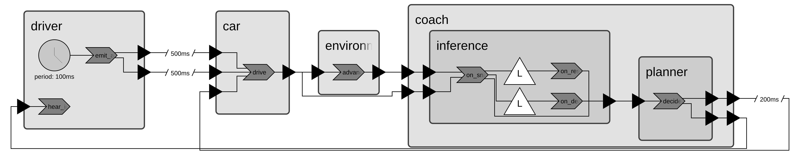

# Embodied AI Lab: Agentic Driving Coach

> This template repository is designed as a project lab for the combined course of
> [CSE 494](https://catalog.apps.asu.edu/catalog/classes/classlist?keywords=85268&searchType=all&term=2267#detailsOpen=85268-104231)
> and [CSE 598](https://catalog.apps.asu.edu/catalog/classes/classlist?keywords=87933&searchType=all&term=2267#detailsOpen=87933-104278),
> "Topic: Intelligent and Safe Cyber-Physical Systems" (ISCPS in short),
> at Arizona State University (ASU) in Fall 2026.
> If you have any questions about this project lab, please get in touch with the instructor,
> [Hokeun Kim](https://hokeun.github.io/), via [hokeun@asu.edu](mailto:hokeun@asu.edu).

This project puts a small local LLM inside the control loop of a simulated car
approaching a stop sign. You will use Xronos reactors to study logical time,
wall-clock inference latency, deadline misses, deterministic fallback, and
physical stopping outcomes. Arizona State University (ASU)'s
[Sol Supercomputer](https://docs.rc.asu.edu/about) is the primary platform.

This project lab is inspired by *Agentic Driving Coach*
([arXiv:2604.11705](https://arxiv.org/abs/2604.11705)) by Deeksha Prahlad, Daniel Fan, and Hokeun Kim
(to appear in the proceedings of [FMSys'26](https://fmsys-org.github.io/2026/program.html#main))
and this lab uses
[Xronos Python SDK](https://docs.xronos.com/python_sdk/getting_started.html) 0.13.1 for its reactor implementation.

## Create your private repository

Before you begin the technical work:

1. Open this GitHub template repository.
2. Select **Use this template**.
3. Select **Create a new repository**.
4. Create the repository under your or your group's GitHub account.
5. Choose a clear repository name (e.g., `my-agentic-driving-coach` or `group05-agentic-driving-coach`).
6. Set the visibility to **Private**.
7. Do not publish course work in a public repository.
8. Add only your project partners as collaborators.
9. Clone your newly created private repository, not this template repository.
10. Do your course work and commits in that private repository.

A private repository protects your work and keeps your course submission
separate from the shared starter repository. For example:

```bash
git clone git@github.com:<OWNER>/<PRIVATE_REPOSITORY>.git
cd <PRIVATE_REPOSITORY>
```

`<OWNER>` above should be replaced with your (or your project partner's) GitHub username,
and `<PRIVATE_REPOSITORY>` should be replaced with your repository.

## Run on ASU Sol

Use Sol for the primary workflow. Login nodes are for cloning, editing, and
submitting jobs. Build the image, run Python, download models, and run
inference only inside a compute allocation.

Clone your private repository into scratch:

```bash
cd /scratch/$USER
git clone git@github.com:<OWNER>/<PRIVATE_REPOSITORY>.git
cd <PRIVATE_REPOSITORY>
```

Request a CPU allocation, load the required modules, and build the image:

```bash
interactive -A class_cse494598fall2026 -p public -q class -t 30 -c 4
module load apptainer/1.4.5 squashfs-4.6.1-gcc-11.2.0
cd /scratch/$USER/<PRIVATE_REPOSITORY>
apptainer build /scratch/$USER/agentic-driving-coach.sif \
    containers/Apptainer.def
```

Define two helpers in the allocation:

```bash
export SIF=/scratch/$USER/agentic-driving-coach.sif
coach() {
    apptainer exec "$SIF" env PYTHONPATH=src \
        python -m agentic_driving_coach "$@"
}
coachpy() {
    apptainer exec "$SIF" env PYTHONPATH=src python "$@"
}
```

Check the environment and run the four Xronos examples:

```bash
coach doctor
coachpy scripts/check_environment.py
coachpy examples/01_hello_reactor.py
coachpy examples/02_timer_and_ports.py
coachpy examples/03_logical_delay.py
coachpy examples/04_deadline_lag.py
```

See the [annotated Xronos examples guide](examples/README.md) for all five
warm-ups, including the real-time deadline-race example, and for diagrams that
map each program's Python declarations to its reactor topology.

Run the deterministic rule and replay baselines:

```bash
coach run --scenario stop-sign --driver beginner \
    --coach rule --fast --output results/rule-a
coach run --scenario stop-sign --driver beginner \
    --coach rule --fast --output results/rule-b
coach run --scenario stop-sign --driver beginner \
    --coach replay --trace data/replay/example_trace.jsonl --fast \
    --output results/replay
```

Exit the CPU allocation. For live models, request a GPU allocation and start
Ollama there:

```bash
exit
interactive -A class_cse494598fall2026 -p htc -q class -t 60 -c 8 \
    --mem=24G --gres=gpu:a100.20gb=1
module load apptainer/1.4.5 zstd-1.5.2-gcc-11.2.0
cd /scratch/$USER/<PRIVATE_REPOSITORY>

mkdir -p /scratch/$USER/ollama
curl -fL https://ollama.com/download/ollama-linux-amd64.tar.zst \
    -o /scratch/$USER/ollama-linux-amd64.tar.zst
zstd -dc /scratch/$USER/ollama-linux-amd64.tar.zst \
    | tar -xf - -C /scratch/$USER/ollama

export PATH=/scratch/$USER/ollama/bin:$PATH
export OLLAMA_MODELS=/scratch/$USER/ollama-models
export OLLAMA_HOST=http://127.0.0.1:11434
ollama serve > ollama-live.log 2>&1 &
OLLAMA_PID=$!
trap 'kill "$OLLAMA_PID" 2>/dev/null || true' EXIT

ollama pull llama3.2:1b
ollama pull llama3.2:3b
ollama list
```

Define `SIF`, `coach`, and `coachpy` again as shown above. Then warm the
models and run one live trial for each:

```bash
coach doctor --live --warm --models llama3.2:1b llama3.2:3b \
    --warmup-timeout-s 600
coach run --scenario stop-sign --driver beginner \
    --coach ollama --model llama3.2:1b --deadline-ms 1700 \
    --output results/live-1b
coach run --scenario stop-sign --driver beginner \
    --coach ollama --model llama3.2:3b --deadline-ms 1700 \
    --output results/live-3b
coach compare-behaviors \
    --model llama3.2:3b --drivers beginner advanced \
    --repetitions 3 --deadline-ms 1700 \
    --output results/behavior-comparison
```

The required Sol deadline is 1,700 milliseconds. Keep the same driver,
prompt, deadline, and temperature when comparing models.

The provided batch script is the canonical model-comparison run. It starts and
stops its own Ollama server, uses models already stored in scratch, runs three
repetitions per model, and checks for numeric latency samples:

```bash
exit
cd /scratch/$USER/<PRIVATE_REPOSITORY>
sbatch slurm/run_agentic_driving_coach.sbatch
squeue -u "$USER"
```

Results appear under `results/model-comparison-<jobid>/`. Each comparison
creates `comparison.csv`, `comparison.json`, `comparison.png`, and one
directory per run. A standalone run creates `run.csv`, `summary.json`,
`trace.jsonl`, `manifest.json`, and `run_overview.png`.

Create `submission/answers.md` once, fill it in, and then build the submission
ZIP inside a CPU allocation:

```bash
cp submission/answers_template.md submission/answers.md
# Fill in submission/answers.md before continuing.

interactive -A class_cse494598fall2026 -p public -q class -t 15 -c 2
module load apptainer/1.4.5
cd /scratch/$USER/<PRIVATE_REPOSITORY>
apptainer exec /scratch/$USER/agentic-driving-coach.sif \
    env PYTHONPATH=src python scripts/make_submission.py \
    --groupid <groupid>
```

The submission ZIP includes `answers.md`, the complete project source and
configuration, and the required experiment results. Project files are included
whether or not they have been committed to Git. Review the ZIP contents before
uploading it:

```bash
unzip -l submission/group<groupid>_agentic-driving-coach.zip
```

Read [ASSIGNMENT.md](ASSIGNMENT.md) for the questions, required repetitions,
deliverables, and rubric.

## Optional: run on your own Linux machine

Ubuntu 22.04 or newer with Python 3.10 through 3.13 is supported. WSL2 may be
used as a Linux environment.

```bash
python3 -m venv .venv
source .venv/bin/activate
python -m pip install --upgrade pip "setuptools>=68"
pip install -e .
python -m agentic_driving_coach doctor
coach() { python -m agentic_driving_coach "$@"; }
coachpy() { python "$@"; }
```

Install and start Ollama for live model runs. Use the same commands as on Sol,
but a local deadline may differ from the required Sol value because inference
latency depends on the machine.

## System summary

Driver commands reach Car after a 500 ms logical delay. Coach emergency
actuation reaches Car after a 200 ms logical delay. Environment provides the
distance to the stop sign. The hierarchical Coach contains inference and
planning reactors. It can use a rule policy, a replay trace, or live Ollama
responses, and it applies the deterministic fallback when a response is late,
unsafe, or malformed. Recorder writes the result files used in the assignment.

The system follows *Agentic Driving Coach*
([arXiv:2604.11705](https://arxiv.org/abs/2604.11705)) by Deeksha Prahlad, Daniel Fan, and Hokeun Kim.
The [original implementation](https://github.com/asu-kim/agentic-driving-coach)
using [Lingua Franca](https://www.lf-lang.org/)
is reimplemented here with the
[Xronos Python SDK](https://docs.xronos.com/python_sdk/getting_started.html) 0.13.1.

### Reactor topology

[](diagrams/agentic_driving_coach_overview.png)

The closed loop runs from the driver's 100 ms timer through the car and
environment to the hierarchical coach. Inside the coach, the inference child
races a response against a deadline before the planner emits an instruction or
actuation. The two driver commands cross 500 ms delayed connections, and coach
actuation returns to the car over a 200 ms delayed connection. In the figure,
chevrons are reactions, clock-faced circles are periodic timers, `L` triangles
are programmable logical timers, and a slashed connection carries the labeled
logical delay. Click the image to inspect the full-size topology.

The overview omits recorder taps for readability. The
[complete topology including the Recorder](diagrams/agentic_driving_coach.png)
and the [live-inference topology](diagrams/agentic_driving_coach_live.png) are
also available, while the individual warm-up diagrams are explained in
[`examples/README.md`](examples/README.md).

## License

BSD 2-Clause. This repository is adapted from the BSD-2-licensed
[Agentic Driving Coach implementation](https://github.com/asu-kim/agentic-driving-coach).
See [THIRD_PARTY_NOTICES.md](THIRD_PARTY_NOTICES.md).
