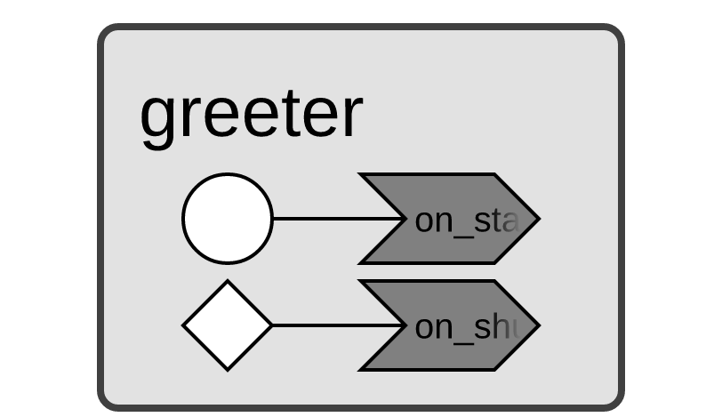
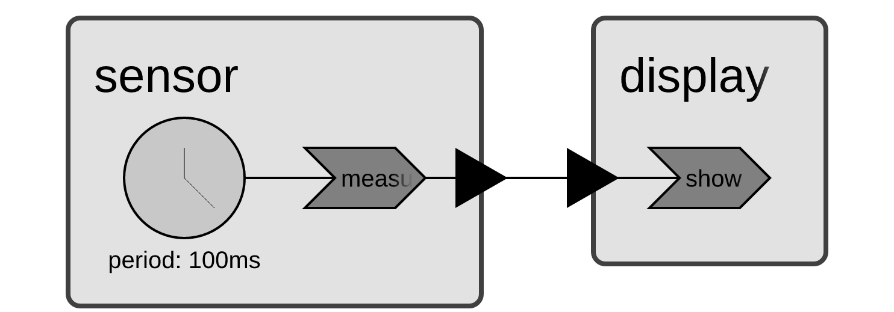
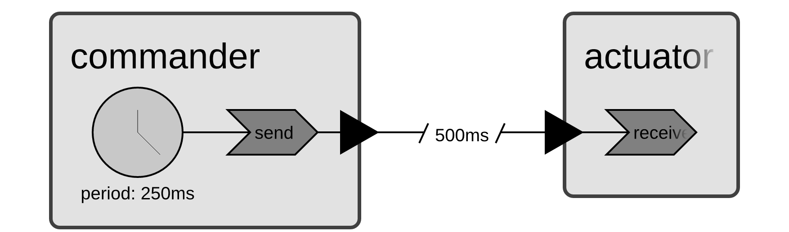
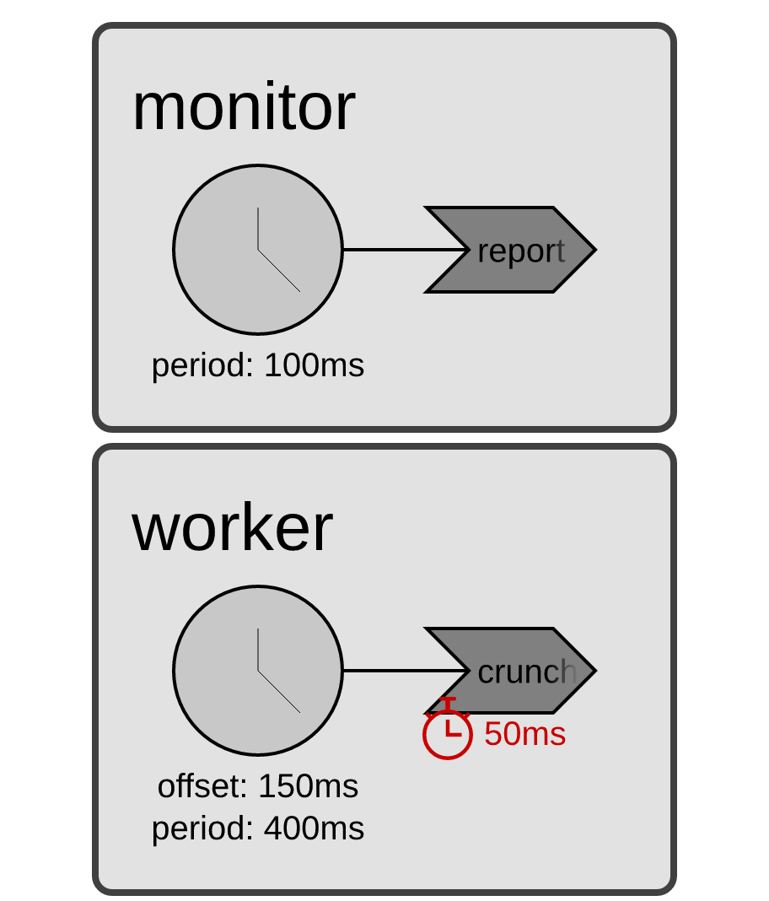

# Xronos Python warm-up examples

These five standalone programs introduce the Xronos concepts used by the
Agentic Driving Coach. Run them from the repository root, then use the
topology diagrams to connect each declaration in the Python code to the
reactors, events, reactions, ports, and timing constraints created at runtime.

```bash
coachpy examples/01_hello_reactor.py
coachpy examples/02_timer_and_ports.py
coachpy examples/03_logical_delay.py
coachpy examples/04_deadline_lag.py
coachpy examples/05_retroactive_fallback.py    # real time, about 4 s
```

The diagrams show program structure, not a timeline or an execution trace.
The [Xronos Diagram View](https://docs.xronos.com/diagrams.html) similarly
visualizes the reactors and relationships in a program. The
[Python SDK getting-started guide](https://docs.xronos.com/python_sdk/getting_started.html)
and [Python API reference](https://docs.xronos.com/python_sdk/api.html) provide
the corresponding SDK definitions.

## Reading the diagrams

| Diagram element | Meaning in these programs |
|---|---|
| Rounded gray box | A reactor instance |
| Gray chevron | A reaction |
| Clock-faced circle | A periodic timer |
| White triangle marked `L` | A programmable logical timer |
| Black triangle on a reactor boundary | A port |
| Connection marked with slashes and a duration | A logical delay |
| Red clock and duration beside a reaction | A reaction deadline |

Lines entering a reaction identify its triggers. Lines leaving a reaction
identify effects such as setting an output port or scheduling a programmable
timer. Startup and shutdown are special one-time events; they use their own
symbols in the first diagram.

## 1. Hello reactor

Source: [`01_hello_reactor.py`](01_hello_reactor.py)

<a href="../diagrams/01_hello_reactor.png">
  
</a>

The environment creates one `Greeter` reactor. Its `on_startup` reaction is
triggered once when execution begins, and `on_shutdown` is triggered once just
before execution ends. Because the program schedules no future events, its
event queue becomes empty immediately: shutdown occurs at logical time zero,
even though the environment has a 500 ms timeout. The timeout is an upper
bound, not a request to keep an idle program alive.

## 2. Periodic timer and typed ports

Source: [`02_timer_and_ports.py`](02_timer_and_ports.py)

<a href="../diagrams/02_timer_and_ports.png">
  
</a>

The `Sensor` reactor's 100 ms periodic timer triggers `measure`. That reaction
updates a reading and sets the typed `sample` output port. The connection
delivers the value to the `Display` reactor's input port, which triggers
`show`. There is no delay marker on the connection, so the send and receive
have the same logical timestamp. With a 450 ms timeout, the program prints
samples at logical times 0, 100, 200, 300, and 400 ms.

## 3. Logical connection delay

Source: [`03_logical_delay.py`](03_logical_delay.py)

<a href="../diagrams/03_logical_delay.png">
  
</a>

The `Commander` timer triggers `send` every 250 ms. The output-to-input
connection is marked with a 500 ms logical delay, matching the `delay=`
argument passed to `env.connect(...)`. Xronos therefore timestamps every
arrival exactly 500 ms after its send, regardless of wall-clock scheduling
jitter. The `Actuator.receive` reaction runs when the delayed event reaches
its input port.

## 4. Deadline, lag, and slack

Source: [`04_deadline_lag.py`](04_deadline_lag.py)

<a href="../diagrams/04_deadline_lag.png">
  
</a>

The two reactors are structurally independent. `FastMonitor.report` runs from
a 100 ms timer and reports how far wall-clock execution is behind the current
logical event. `SlowWorker.crunch` starts at logical time 150 ms, repeats every
400 ms, and has the 50 ms deadline shown in red. Its handler deliberately
works for about 80 ms, so its remaining slack crosses zero and nearby monitor
events accumulate lag. The diagram records the declared deadline; the printed
output shows the changing runtime measurements.

## 5. Retroactive fallback and an enforceable race

Source: [`05_retroactive_fallback.py`](05_retroactive_fallback.py)

| Phase A: blocking, after-the-fact check | Phase B: response/deadline race |
|---|---|
| [](../diagrams/05a_retroactive_fallback_blocking.png) | [](../diagrams/05b_retroactive_fallback_race.png) |

Both phases submit one request at logical time 200 ms, model 1,200 ms of
latency, and use a 400 ms deadline. In Phase A, `infer` waits inside its
handler and can inspect the deadline only after that wait returns. The first
diagram therefore contains no separately schedulable deadline event.

In Phase B, `infer` returns immediately after scheduling a response timer and
a deadline timer. The two `L` triangles feed `on_response` and `on_deadline`,
so the runtime can process whichever event arrives first; a later response is
then discarded. This is the structural pattern used by the lab's coach. The
live implementation replaces the modeled response timer with a physical event
fed by the inference worker while retaining the independently scheduled
deadline.
